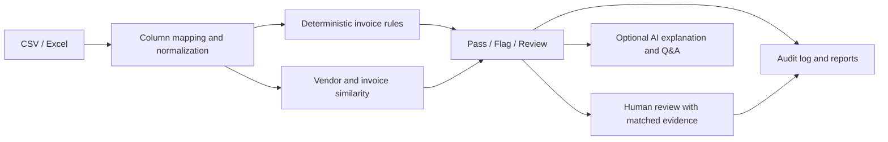

# Hackathon pitch notes

## One-line pitch

**An explainable invoice review assistant that screens every row, sends uncertain cases to people, and keeps the evidence and decisions auditable.**

## Fit to the problem statement

- **Invoice / expense file:** accepts CSV and Excel uploads, maps common finance-export column names, and includes a sample file.
- **Rule checks and short report:** checks required fields, duplicates, dates, category limits, and possible split claims; the exception report is downloadable as CSV.
- **Enterprise-grade routing:** clean rows auto-pass. Every flagged or uncertain exception stays in the human review queue; confidence determines prioritization, not automatic payment approval.
- **Explainable findings:** each row has a plain-language rule explanation. Duplicate and related-claim findings include the matched invoice and side-by-side evidence when a comparison applies.
- **Auditability:** the log records each system screening outcome, every reviewer decision and reason, and approved rule changes.

## 45-second spoken version

Finance teams have to check every invoice, but exact-match rules miss near duplicates and manual spot checks are difficult to audit. Veri-Fi screens each row for duplicates, missing fields, invalid dates, category-limit violations, and possible split claims. Clear rule matches are flagged; uncertain similarity matches go to a reviewer with the matched invoice and evidence side by side. Every system finding and reviewer action is recorded. Optional AI explains the evidence, but never makes the approval decision. In our synthetic demo, 93 invoices produce 30 exceptions for focused review while 63 pass automatically.

## Suggested three-slide story

### 1. The gap

- Teams spend time checking routine invoices and still miss subtle duplicates.
- Exact matches are not enough: invoice numbers and vendor names can vary.
- Review decisions need a reason and a traceable record.

### 2. The product

- Screen every row with deterministic, configurable checks.
- Compare likely duplicates and show the matched record.
- Keep uncertain cases with a human reviewer; log the reason and decision.
- Use AI only for optional explanations and questions about the loaded data.

### 3. The demo and next step

- Start the guided demo, inspect the exact and fuzzy duplicate examples, and record one review decision.
- Show the audit entry, then the vendor/category risk overview.
- Next: test against anonymized finance exports, collect reviewer feedback, and measure precision, recall, and review time before making real-world impact claims.

## Architecture

## Likely judge questions

**Why use AI at all?**

The approval decision needs to be repeatable and reviewable, so rules decide. Similarity identifies candidates; the reviewer resolves ambiguous cases. Optional AI makes the evidence easier to understand and query.

**How do you avoid false positives?**

The demo distinguishes high-confidence flags from lower-confidence review items. Similarity thresholds are configurable, matched records and signals are visible, and reviewer decisions are recorded. Production use would require validation on representative, anonymized data and measurement of precision and recall.

**What does “money at risk” mean?**

It is a screening estimate based on flagged duplicate amounts and over-limit excesses. It is not a confirmed loss or a payment instruction.

**What data is in the demo?**

All included invoices are synthetic. The project ships with a 93-row scenario set and a small example upload CSV using common finance-export column names.

## Be precise about demo metrics

The 93-row sample, its flags, and the time-saved estimate are demo inputs. Do not present them as measured customer outcomes. The time estimate is adjustable in the interface; it is not benchmarked.
